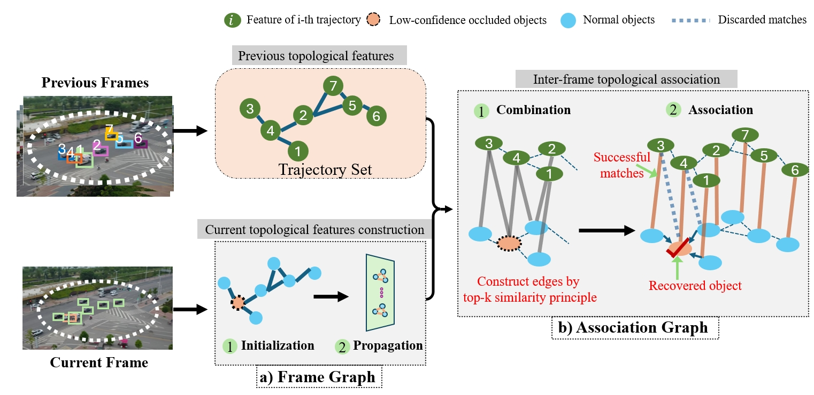
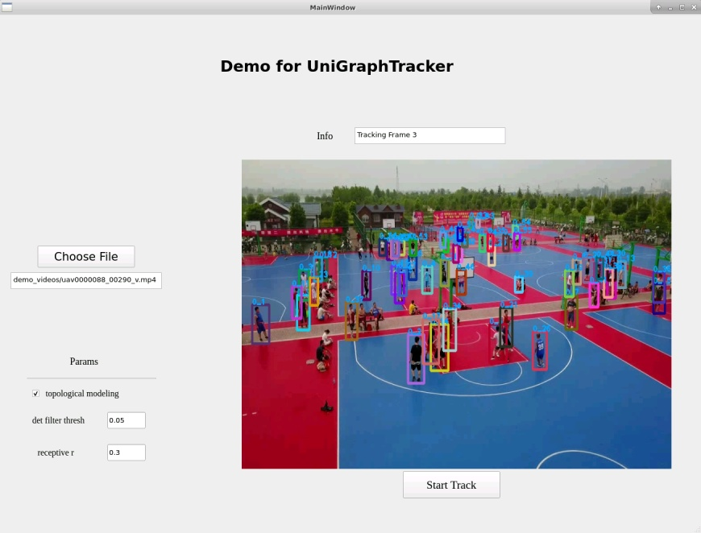

# [IEEE TGRS 2024] Learning a robust topological relationship for online MOT in UAV scenarios

****
***Abstract:*** Many existing MOT methods tend to model each object's feature individually. However, under acute viewpoint variation and occlusion, there may exist significant differences between the current and historical features for objects, which easily leads to object loss. To alleviate these issues, the topological relationships (i.e., geometric shapes formed by objects) should be modeled as a supplement to individual object features to maintain stability. In this paper, we propose a novel MOT framework, which consists of Frame Graph and Association Graph, to leverage the topological relationships both spatially and temporally. Technically, the Frame Graph models distances and angles among objects to resist viewpoint change, while the Association Graph utilizes the inter-frame temporal consistency of topological features to recover occluded objects. Extensive experiments on mainstream datasets demonstrate the effectiveness.
****



## Run Demo

We choose several challenging UAV captured videos in `./demo_videos`, and we provide a PyQt programme for easily and conveniently visualize the results in time:



You can specify the video file (*.mp4) and some params of model in the left part. The `det filter thresh` means the threshold of filtering the detections in current frame, and `receptive r` means how far can the algorithm "see" when modeling the proposed topological features. After adjusting the settings, you can click `Start Track` immediately and the tracking process will restart.

*Due to the restrict of large file size of git, please download the trained YOLOX detector in [Google Drive Link](https://drive.google.com/file/d/1jPmiiELUssQ38HOQspJygAJ0vGbD__kl/view?usp=drive_link), and put it into `track/weights`*

*Please note that before running the demo, the environment is requried to be installed following the instruction below:*

## Install Environments

My env:

- Ubuntu 18.04
- Python：3.9, Pytorch: 1.12

First clone this repo:

```bash
git clone --recurse-submodules https://github.com/JackWoo0831/UniGraphTracker.git
```

### 1. By Docker

Run
```bash
sudo docker build -t unigraphtracker .
sudo docker run -it -rm --gpus all unigraphtracker
```

### 2. By Anaconda (Recommended)

First create a new virtual env

```bash
conda create -n myenv python==3.9
conda activate myenv
```

Then, you can directly execute:

```bash
sh experiments/build_env.sh
```

Or install step by step manually:

run 

```bash
# basic
pip3 install cython
pip3 install numpy==1.23.5
# torch
pip3 install torch==1.12.1+cu113 torchvision==0.13.1+cu113 --extra-index-url https://download.pytorch.org/whl/cu113
# pyg
pip3 install assets/pyg_wheels/torch_scatter-2.1.0+pt112cu113-cp39-cp39-linux_x86_64.whl 
pip3 install assets/pyg_wheels/torch_sparse-0.6.16+pt112cu113-cp39-cp39-linux_x86_64.whl
pip3 install assets/pyg_wheels/torch_cluster-1.6.0+pt112cu113-cp39-cp39-linux_x86_64.whl
pip3 install assets/pyg_wheels/torch_spline_conv-1.2.1+pt112cu113-cp39-cp39-linux_x86_64.whl
pip3 install torch-geometric==2.2.0
# others
pip3 install --no-cache-dir -r requirements.txt
# yolox
git clone -b 0.1.0 git@github.com:Megvii-BaseDetection/YOLOX.git
cd YOLOX
pip3 install -v -e .
# pycocotools
pip3 install 'git+https://github.com/cocodataset/cocoapi.git#subdirectory=PythonAPI'
cd ..
# torchreid
cd deep-person-reid
python setup.py develop

```

The code is tested on NVIDIA A100, 2080Ti and 3090.

## Training

### Data Preparation

Supported datasets are VisDrone and UAVDT. First we should convert the original annotation to the *YOLO* form, like FairMOT and JDE. After converting the format, the dataset should be orgnized as follows:

```
dataset_name
     |---images
           |---train
                 |---sequence_name1
                             |---000001.jpg
                             |---000002.jpg ...
           |---val ...
           |---test ...

     |
     |---labels
           |---train
                 |---sequence_name1
                             |---000001.txt
                             |---000002.txt ...
           |---val ...
           |---test ...
```

In each txt, the content is as:

```
<object id>, <x0>, <y0>, <x1>, <y1>, <category id>
```

The corresponding codes are `track/tools/convert_VisDrone_to_yolo.py`, `track/tools/convert_UAVDT_to_yolo.py`. Please note that you should modify the `DATA_ROOT` at the beginning of the script to your own path. 

Then, run:

```bash
sh experiments/convert_VisDrone_format.sh  # for VisDrone
sh experiments/convert_UAVDT_format.sh  # for UAVDT
```

Afterwards, check `track/cfgs/dataset.yaml`, change `dataset_name` to the dataset you want to train, and same as above, change the `path` value in every dataset.

> The proposed framework follows the 'tracking by detection' paradigm, so you should train the detector separately. please note that YOLOX need COCO format, see `track/tools/convert_dataset_to_coco.py`, and YOLOv8 etc. need YOLO format with *normalized* bbox size, which is different to this code. The training stage of ugt does not need the forward process of detectors.

**For custom dataset**: Please do:

1. Write and run the script like `track/tools/convert_VisDrone_to_yolo.py` to generate the txt file for each frame in each sequence.
2. Add the description in `track/cfgs/dataset.yaml` like `VisDrone, UAVDT` part, and change the `dataset_name` in line 1.


### Start training

The setting of training process is in `track/cfgs/train.yaml`. Theoretically you do not need modify it.

For training, run 

```bash
python3 track/train.py
```

By default, the saved weights will be in `track/saved_weights`

## Inference

*Due to the restrict of large file size of git, please download the trained YOLOX detector in [Google Drive Link](https://drive.google.com/file/d/1jPmiiELUssQ38HOQspJygAJ0vGbD__kl/view?usp=drive_link), and put it into `track/weights`*

The reid model, trained UGT models are in `track/weights`. 

The setting of inference (tracking) process is in `track/cfgs/track.yaml`. Generally you may need to modify:
- In `detector`: `name`: which kind of detector you want to use and the `weights`.
- In `tracker`: `model_path`, the trained pth file of ugt.

Then run

```bash
python3 track/track.py --save_data_type mot_challenge 
```

If you want to visualize the predicted results, please add `--save_images` or `--save_videos`.

If you want to test the quantitative performace like `MOTA, HOTA` etc., please refer to [TrackEval](https://github.com/JonathonLuiten/TrackEval) or [Easier_To_Use_TrackEval](https://github.com/JackWoo0831/Easier_To_Use_TrackEval).

## Acknowledgement

We sincerely thank the anonymous reviewers for their insightful criticism and suggestions on this article, which have improved its presentation from the original version.
